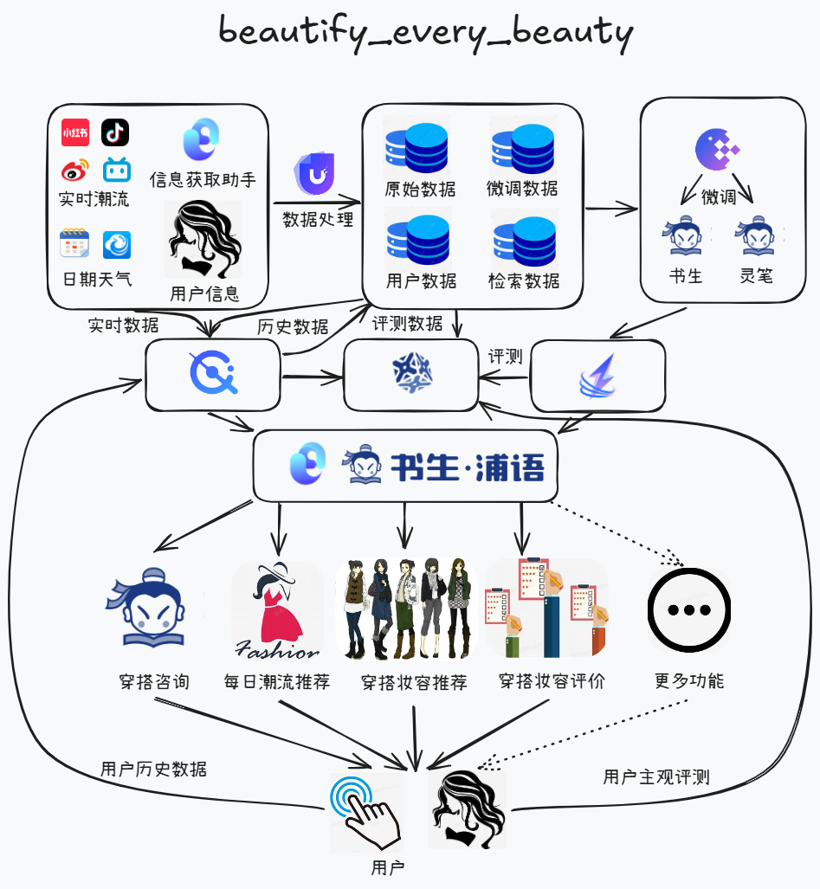

# beautify_every_beauty  :dress:

# 项目简介 :blush:

beautify_every_beauty是基于书生大模型InternLM的专属穿搭妆容助手。

- 通过Lagent实现信息获取助手，实时从各类数据源中获取最新潮流信息、气候温度情况以及用户个人信息，以形成最新最潮的个性化数据。

- 通过MindU进行数据的清洗和预处理，将数据进行统一格式化，方便后续的模型训练以及检索。将数据存入各数据仓库中。

- 将清洗后的高质量数据微调书生和灵笔大模型，赋予大模型图文能力和穿搭妆容的领域知识，以成为领域专家。

- 使用LMdeploy进行模型部署

- 使用Opencompass进行评测，持续优化。并且将用户的反馈收集，用于主观评测，推进后续模型升级。

- 通过Mindsearch进行数据检索，将用户需求转化为检索语句，通过检索语句找到最匹配的穿搭方案。

- 使用Lagent构建助手，提供穿搭咨询，每日潮流推荐，穿搭妆容推荐，穿搭妆容评价。

- 后续拟开展一键换衣，虚拟衣柜等功能，敬请期待

# 项目架构 :sunglasses:

